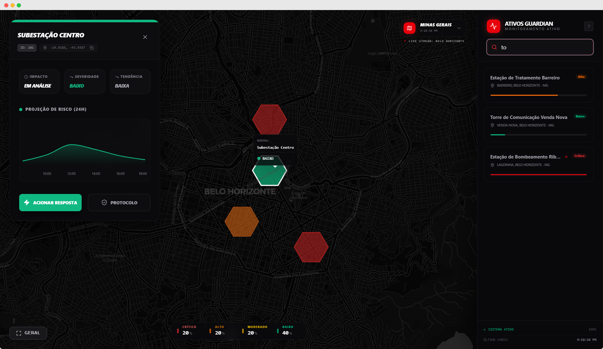
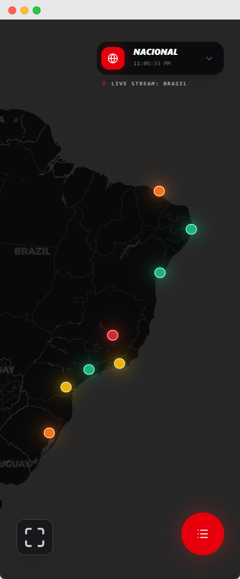

# 🛡️ Guardian Infra  
### Dashboard de Inteligência Climática para Ativos Críticos

<p align="center">
  
</p>

<p align="center">
  <strong>Monitoramento tático em tempo real para tomada de decisão em cenários de risco climático extremo.</strong>
</p>

<p align="center">
  <a href="https://reactjs.org/"></a>
  <a href="https://vitejs.dev/"></a>
  <a href="https://tailwindcss.com/"></a>
  <a href="https://www.typescriptlang.org/"></a>
  <a href="https://vercel.com/"></a>
</p>

---

## 📖 Visão Geral

O **Guardian Infra** é uma plataforma de **monitoramento climático e gestão de risco** voltada para **ativos críticos de infraestrutura**, como:

- Subestações elétricas  
- Data centers  
- Centros de distribuição  
- Infraestruturas estratégicas em áreas de risco  

A aplicação transforma **dados geofísicos e climáticos** em **inteligência acionável**, permitindo que operadores tomem decisões rápidas e precisas durante **eventos extremos**, como inundações e alagamentos.

---

## 📸 Demonstração Visual

<table width="100%">
  <tr>
    <td width="50%" align="center">
      
      <br/>
      <em>Interface tática desktop com ativos georreferenciados</em>
    </td>
    <td width="50%" align="center">
      
      <br/>
      <em>Experiência Mobile-First</em>
    </td>
  </tr>
</table>

---

## 🧩 Funcionalidades Principais

- 🗺️ **Mapa Interativo:** Visualização georreferenciada de ativos críticos
- 🚦 **Indicadores de Risco:** Classificação visual por níveis (Verde → Vermelho)
- 🚨 **Alertas Críticos:** Notificações animadas para riscos iminentes
- ⏱️ **T.E.I. (Tempo Estimado para Impacto):** Informação acionável em tempo real
- 🔄 **Atualização Contínua:** Simulação de dados em tempo real via polling
- 📱 **Responsividade Total:** Desktop, tablet e mobile

---

## 🛠️ Stack Tecnológica & Arquitetura

### ⚙️ Core
- **React 19**
- **Vite 7**
- **TypeScript 5**

### 🌍 Geointeligência
- **Leaflet**
- **Custom Risk Layers**

### 🎨 UI / UX
- **Tailwind CSS v4**
- **Radix UI**
- **Lucide React**
- **Framer Motion**

### 🧠 Estado & Dados
- **Zustand 5**
- **TanStack Query v5** (Polling a cada 5s)

---

## 🚀 Como Rodar o Projeto Localmente

```bash
git clone https://github.com/GustavoAlmeida-cy/guardian-infra-dashboard.git
cd guardian-infra-dashboard
npm install
npm run dev
```

---

## 👨‍💻 Autor

**Gustavo Almeida**  
📧 [gustavo.almeida.cy@gmail.com](mailto:gustavo.almeida.cy@gmail.com)  

> Desafio Técnico — Desenvolvedor Front-end React @ Sipremo
